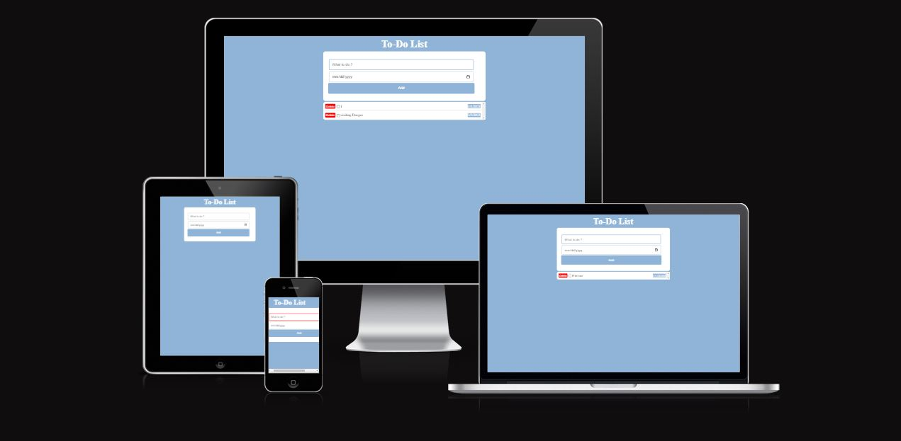
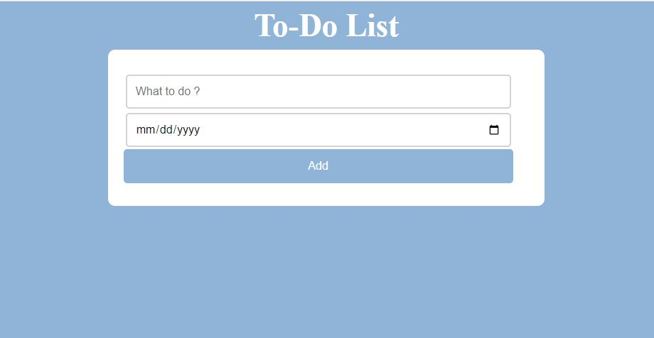
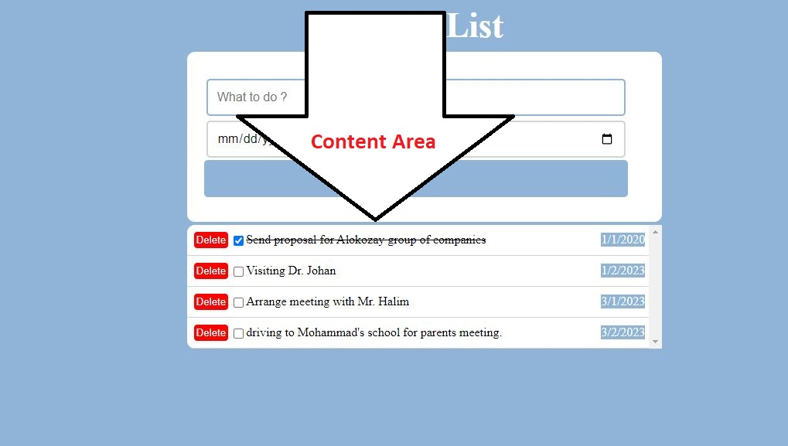
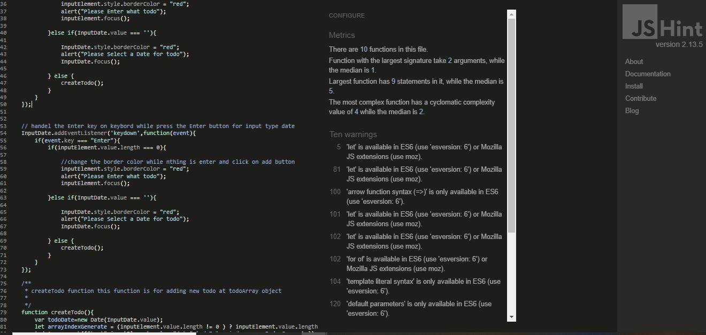

# To-Do List

##### Table of Contents

[To-Do List](#to-do-list)

[Features](#features)

[Testing User Experience Design](#testing-user-experience-design)

[User Demographic](#user-demographic)

[Application Owners Goals](#application-owners-goals)

[Responsive on all device sizes](#responsive-on-all-device-sizes)

[Technologies](#technologies)

[Testing](#testing)

[Additional Testing](#additional-testing)

[Deployment](#deployment)

[Credits](#credits)

[Acknowledgements](#acknowledgements)

#### [To-Do List](https://sadafsafi22.github.io/To-do-list/)

To-do list is simple tool to schedule daily activity, it helps to have an organized list of activity which are sorted by date and helps to record business or personal tasks, when you complete the task it makes you feel a sense of achievement and keep you motivate to moving forward. 

## Features
This application contains one home page which has two parts:

* 	Input box
     -	Input box area present a primary text input which user can describe their assignment.
*   Date Box
    - This box is located on the bottom of the Input box, In this area user can type the deadline they type by themself (MM/DD/YY) or on the right side also they can choose date from calendar.
*   Add Button
    - After writing the task description and date, user should add the task to record it on the to-do list content, this function is under the date box.

*   Content Area
    - This function is invisible until we record a task after we record this page will appear, each task which is shows here have description, deadline, delete option and checkbox,
*   Checkbox
    - after user complete their task they should mark the checkbox, and the completed task take style with line on the text.
*   Delete Button
    -  By clicking on Delete Button it remove that task from the list.

## Testing User Experience Design
We are care for our users there for we create this Application which is designed  is  for users which want to have an organized list of their tasks to record their tasks and see specific dateline of each tasks which really helps to accomplish them successfully.

## User Demographic
This App is helpful for users which are overcome with the amount of work and forget the exact date of their important activities.
 
## Application Owner’s Goals
The key goal is to increase the efficiency and effectiveness, also provide value to the organization, and designed applied application that be effective.

## Responsive on all device sizes
This application is designed to be responsive for all devices such as computer, iPad and mobile.

## Technologies

* Languages Used
    - HTML5
    - CSS3
    - JavaScript

* IDE & Libraries Used
    - **Gitpot:** gitpot is used to arrange and help to write clean code.
    - **Git:** is used for variety control to apply the Gitpod terminal to Git commit and push the GitHub.
    - **GitHub:** is used to collect codes of the project after the project codes are pushed from Git.

## Testing
* HTML 
    - All codes are validate and there were no errors when we check through the [W3C HTML Validator](https://validator.w3.org/)
        * [MainPage](https://validator.w3.org/nu/?doc=https%3A%2F%2Fsadafsafi22.github.io%2FTo-do-list%2F)
       
* CSS 
    - All codes are validate and there were no errors when we check through the [W3C CSS Validator](https://jigsaw.w3.org/css-validator/)
        * [Style CSS](https://jigsaw.w3.org/css-validator/validator?uri=https%3A%2F%2Fsadafsafi22.github.io%2FTo-do-list%2Fassets%2Fcss%2Fstyle.css&profile=css3svg&usermedium=all&warning=1&vextwarning=&lang=en)

* JavaScript
    - just some warnings , no other errors were found using JSHint validator testing.See screenshot below:

## Additional Testing

* The site was tested by Google Chorme, Safari browser and Microsoft Edge.
* The site was observed on different devices like computer, iPad and mobile browsers.
* We asked some of our friends and family to check the site and ensure that all pages are display correctly.

* Unfixed Bugs
    - We solved all the bugs which report to us by mentor and friends from slack community.

* Design
    - Color arrangement, mostly the color is used from within the display color to have a good color arrangement for the website.
    

## Deployment

this site is deployed to github pages. With these flowing steps 
* 	In the GitHub repository, navigate to the setting tab
* 	In the side bar menu select Pages
* 	On the source from dropdown menu select main
* 	Lastly press save button
*   After saved the page is reloaded and site is published 

Your site is published at https://sadafsafi22.github.io/To-do-list/

## Credits
* Content
    - The Project all content text is written by the developer, only on readme.md file some texts which were same as previous project has been taken from the first project of developer.

## Acknowledgements
* My Mentor for constant feedback.
* My Husband Walid Ahmadyar for inspiration, support and useful comments.

